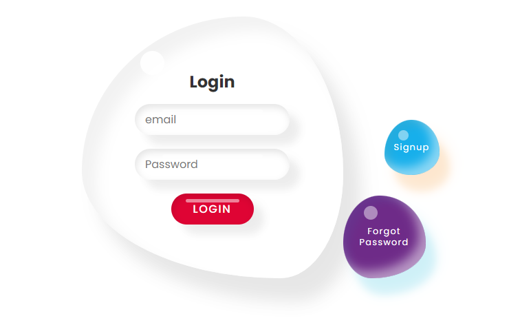
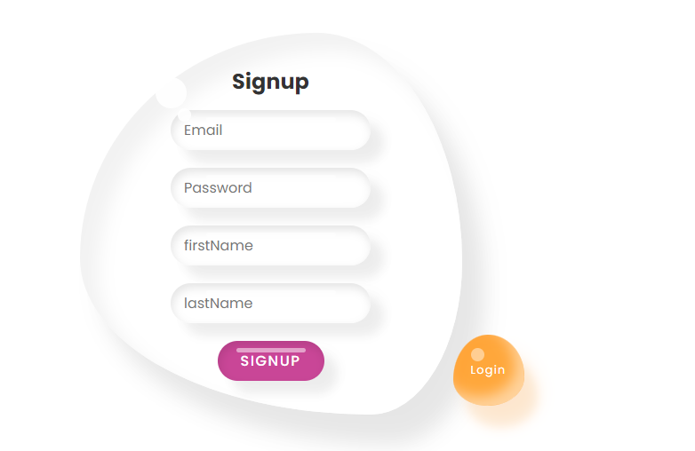
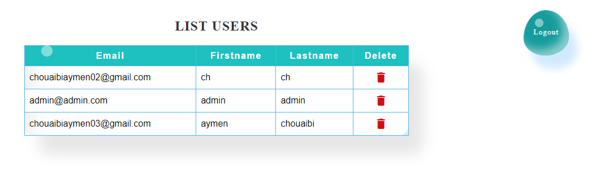

# Application Springboot 3 and angular 17

## Features

- User Registration: Users can register for a new account.
- Email Activation Account: Accounts are activated using secure email validation.
- User Authentication: Existing users can log in to their accounts securely.
- Forget Password: Users can recover their password by requesting a password reset code.
- User List: Display a list and allow deletion, with the ability to change the order of certain users within the list.

#### Page Login

#### Page Signup

#### Page Forget Password

#### Page List

## Technologies Used

### Backend (backEnd)

- Spring Boot 3
- Spring Security 6
- JWT Token Authentication
- Spring Data JPA
- scheduler
- OpenAPI and Swagger UI Documentation
- GitHub Actions

### Frontend (frontEnd)

- Angular
- Interceptor
- Component-Based Architecture
- Lazy Loading
- Authentication Guard
- OpenAPI Generator for Angular

## Contributors

- [Chouaibi Mohamed Aymen](https://github.com/aymen-1996)
